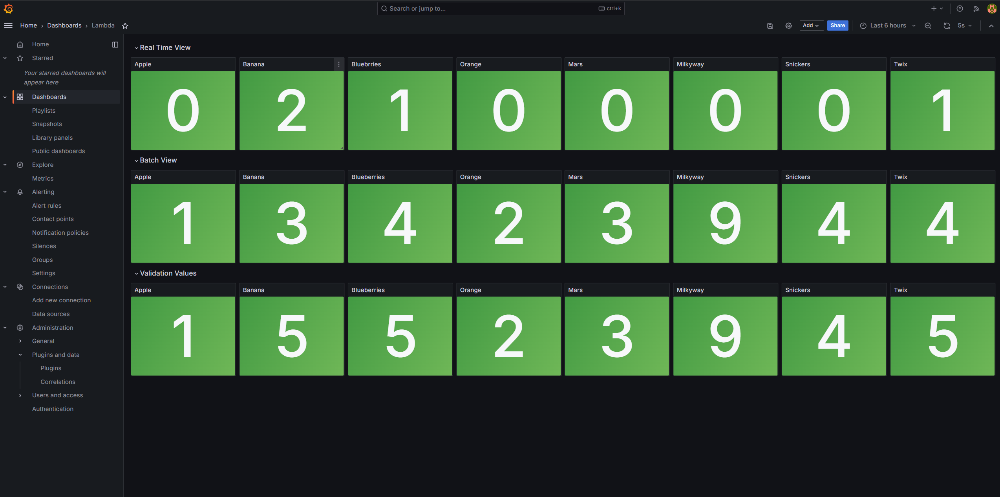
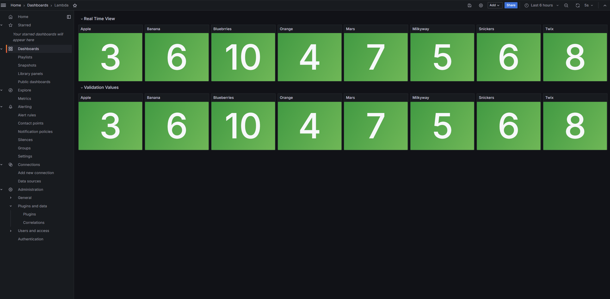

# lambda-kappa-architecture
This is an educational repository to compare lambda and kappa architecture.
The goal is to measure the performance of lambda and kappa, learn more about docker 
containerisation, learn more about frameworks (spark, kafka and hadoop), to implement
lambda and kappa. Also to compare the complexity between both implementations and give 
own feedback about both architecture, problems occured and how they got fixed.

## Introduction

Let's imagine we've got a few snack machines and we want to scale infinitly our snack machines,
to increase our income. For this we would need some kind of data processing, to analyze our
snack machines. 

EXAMPLE: We need to know:
- What snack-machine is not profitable?
- Where are the most people buying from?
- Do we sell more healthy or unhealthy food?
- ...

EXAMPLE: We need to react:
- What snacks are empty soon and where?
- What snack-machine gets broken?
- ...

For this processing this repository shows two kinds of stream-processing implementations. 
Lambda-Architecture and Kappa-Architecture. Focused on a simple question: "how many
items (apple, banana...) of any kind in sum were sold?"

## Requirements

- Docker on your OS
- Optional: Atleast 32GB RAM, but can be set up in lower scale.

## Lambda

#### Start
```
cd lambda
docker-compose up -d
python start_lambda.py
```

After all containers are running we need to configure and start few things. 
Within the folder \lambda\src we can find few python files. Those files are necessary 
to generate data and tell Kafka, Spark, Hadoop and Cassandra what to do. 


Figure 1: Lambda-Architecture

Whole lambda architecture is created out of few docker containers.

- **Kafka** with data-generator and control-center (http://localhost:9021/) 
- **Hadoop** as batch-layer with Namenode (http://localhost:9870/), Masternode, Datanodes 
and Resourcemanager (http://localhost:8088/)
- **Cassandra** for saving different views
- **Spark** with workers and master (http://localhost:8080/)
- **Grafana** for visualization (http://localhost:3000/)

Every container is running within same network (**lambda-network**).

To validate the data and quality of the data and the results kafka is also writing 
all data to cassandra. While hadoop is processing, spark is catching up
new incoming data and serving them as a real-time-view. Is hadoop done
processing spark resets and catching up from the beginning.

## Kappa

#### Start
```
cd kappa
docker-compose up -d
python start_kappa.py
```


Figure 2: Kappa-Architecture

Whole kappa architecture is created out of few docker containers.

- **Kafka** with data-generator and control-center (http://localhost:9021/)
- **Cassandra** for saving different views
- **Spark** with workers and master (http://localhost:8080/)
- **Grafana** for visualization (http://localhost:3000/)

## Grafana Setup

To visualize the whole process you can actually use the kappa and lambda templates 
for grafana. You cana find them in (/grafana_templates/)

### Connect to Apache Cassandra

1. Go to http://localhost:3000
2. login (username=admin, password=admin) # can be changed
3. Go to Connections -> Add new connection -> Apache Cassandra -> Install
4. Go to Connections -> Data sources -> Apache Cassandra
5. Fill up following entry -- Host: cassandra1:9042
6. Save & Test

### Lambda Dashboard


Figure 3: Lambda Dashboard

Lambda dashboard is showing Real Time, Batch and Validation View. Real Time View + Batch View should be
Validation View.

### Kappa Dashboard


Figure 4: Kappa Dashboard

Similar to lambda dashboard, kappa dashboard show the Real Time View and the Validation View. 
Real Time View should be the same as the Validation View. 


## Analysis and Comparison

