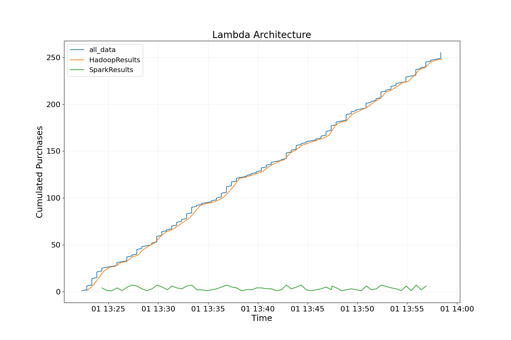
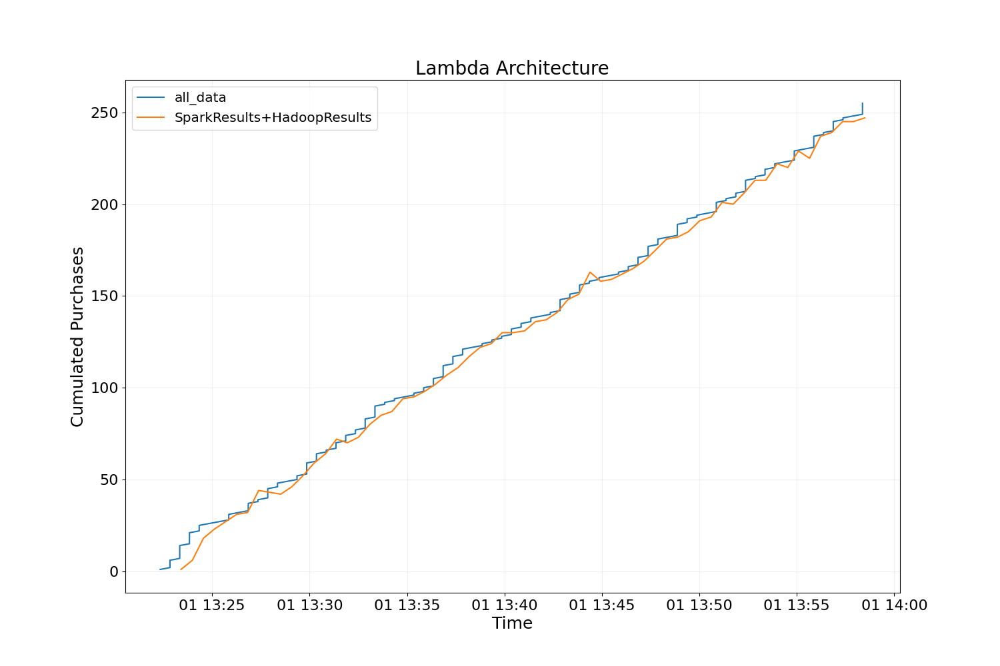

# lambda-kappa-architecture
This is an educational repository to compare lambda and kappa architecture.
The goal is to measure the performance of lambda and kappa, learn more about docker 
containerisation, learn more about frameworks (spark, kafka and hadoop), to implement
lambda and kappa. Also to compare the complexity between both implementations and give 
own feedback about both architecture, problems occured and how they got fixed.

## Introduction

Let's imagine we've got a few snack machines and we want to scale infinitly our snack machines,
to increase our income. For this we would need some kind of data processing, to analyze our
snack machines. 

EXAMPLE: We need to know:
- What snack-machine is not profitable?
- Where are the most people buying from?
- Do we sell more healthy or unhealthy food?
- ...

EXAMPLE: We need to react:
- What snacks are empty soon and where?
- What snack-machine gets broken?
- ...

For this processing this repository shows two kinds of stream-processing implementations. 
Lambda-Architecture and Kappa-Architecture. Focused on a simple question: "how many
items (apple, banana...) of any kind in sum were sold?"

## Requirements

- Docker on your OS
- Optional: Atleast 32GB RAM, but can be set up in lower scale.

## Lambda

#### Start
```
cd lambda
docker-compose up -d
python start_lambda.py
```

After all containers are running we need to configure and start few things. 
Within the folder \lambda\src we can find few python files. Those files are necessary 
to generate data and tell Kafka, Spark, Hadoop and Cassandra what to do. 


Figure 1: Lambda-Architecture

Whole lambda architecture is created out of few docker containers.

- **Kafka** with data-generator and control-center (http://localhost:9021/) 
- **Hadoop** as batch-layer with Namenode (http://localhost:9870/), Masternode, Datanodes 
and Resourcemanager (http://localhost:8088/)
- **Cassandra** for saving different views
- **Spark** with workers and master (http://localhost:8080/)
- **Grafana** for visualization (http://localhost:3000/)

Every container is running within same network (**lambda-network**).

To validate the data and quality of the data and the results kafka is also writing 
all data to cassandra. While hadoop is processing, spark is catching up
new incoming data and serving them as a real-time-view. Is hadoop done
processing spark resets and catching up from the beginning.

## Kappa

#### Start
```
cd kappa
docker-compose up -d
python start_kappa.py
```


Figure 2: Kappa-Architecture

Whole kappa architecture is created out of few docker containers.

- **Kafka** with data-generator and control-center (http://localhost:9021/)
- **Cassandra** for saving different views
- **Spark** with workers and master (http://localhost:8080/)
- **Grafana** for visualization (http://localhost:3000/)

## Grafana Setup

To visualize the whole process you can actually use the kappa and lambda templates 
for grafana. You cana find them in (/grafana_templates/)

### Connect to Apache Cassandra

1. Go to http://localhost:3000
2. login (username=admin, password=admin) # can be changed
3. Go to Connections -> Add new connection -> Apache Cassandra -> Install
4. Go to Connections -> Data sources -> Apache Cassandra
5. Fill up following entry -- Host: cassandra1:9042
6. Save & Test

### Lambda Dashboard


Figure 3: Lambda Dashboard

Lambda dashboard is showing Real Time, Batch and Validation View. Real Time View + Batch View should be
Validation View.

### Kappa Dashboard


Figure 4: Kappa Dashboard

Similar to lambda dashboard, kappa dashboard show the Real Time View and the Validation View. 
Real Time View should be the same as the Validation View. 


## Analysis and Comparison

### Lambda

In Figure 5 and Figure 6 the blue curve represents the real purchases. In 
Figure 5 there is a small delay for the Batch-View (HadoopResults) to catch up
the real purchases. Meanwhile Real-View (SparkResults) is catching up missing
values.


Figure 5: Lambda Results

Figure 6 represents Batch-View + Real-View. Where both results are summed up.
Around 01:13:45 there is a small peak, which is above the real purchases. 
Spark couldn't restart the calculation there. Overall the curve is at some
points above the real purchases as well. Reason for this is synchronization.
Spark needs some time to restart and to get the message to restart. Within
this window spark is still catching messages. That's why the curve is at some
points above the real purchases.


Figure 6: Lambda Results

### Kappa

Figure 7 represents results for the kappa-architecture. Compared to lambda
there is more consistence. Explained by no need of two layers, easier 
implementation and no parallel processing. Also, no communication between
multiple layer is needed, no synchronization. 


Figure 7: Kappa Results

### Conclusion

All in all there is still no "winner" between kappa and lambda (That was expected).
Even though the implementation needs more time for lambda, 
lambda can still be useful.


(**Opinion**)

After implementing both of those architectures I believe, that lambda can 
be better for more complex calculations. Let's take simple Regression
or even something more complex like ARIMA modeling. I believe the batch-layer
can be very important to catch up the correct results. I would say the
time to implement this kind of models could take more time for even kappa than
lambda. Because there is always kind of backup with the batch-layer for lambda.
But it still depends on the case. Is there a need for a fast answer or is
it fine to wait sometime for the batch-process. If you need to react fast or 
if you have a lot of messages and need fast scaling and passing the messages
through the pipe, as soon as possible go with kappa. If you need precise 
results go with lambda and take time to time the batch-layer results.


